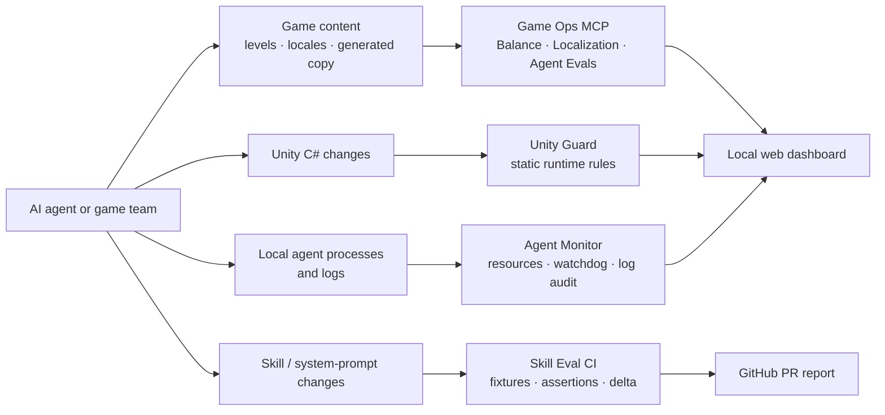

<div align="center">
  

  # Game Ops MCP

  ### A local-first control room for AI-assisted game production

  [](#quick-start)
  [](#architecture)
  [](#mcp-server)
  [](LICENSE)

  **[English](#english) · [Türkçe](#türkçe)**
</div>

> [!TIP]
> Game Ops MCP is not one narrow validator. It is a practical toolkit for validating game content, protecting Unity runtime code, observing local AI-agent workloads, and proving prompt improvements with deterministic evals—without requiring a paid model API.

---

<a id="english"></a>

## English

### Why it exists

AI agents can accelerate game production, but they can also invent malformed level data, omit localization keys, introduce frame-loop allocations, leave background processes running, or claim a prompt is “better” without evidence. Game Ops MCP places deterministic checks at those hand-off points.

It is designed for a solo developer’s laptop, a shared Mac mini, or a Linux VM: run the tools locally, expose the content checks to an MCP client, inspect results in a browser, and enforce the same rules in GitHub Actions.

### One system, five safety layers



### Toolkit at a glance

| Surface | What it protects | What it reports | How to use it |
| --- | --- | --- | --- |
| **Balance Linter** | Level-progression data | Invalid fields, zero rewards, impossible move limits, adjacent move spikes | MCP, web dashboard, direct test |
| **Localization Auditor** | JSON locale packs | Missing keys and incompatible dynamic tokens such as `{playerName}` | MCP, web dashboard, direct test |
| **Agent Eval Runner** | Generated puzzle and notification content | Deterministic scenario score, passed/failed assertions, explanation | MCP and web dashboard |
| **Unity Guard** | Unity C# runtime code | Per-frame GC triggers, LINQ, lookups, scene searches, public Inspector fields | `unity-guard lint` and web dashboard |
| **Agent Monitor** | Claude, Cursor, Codex, MCP, and Python processes | PID, CPU, memory, uptime, log failure patterns, optional watchdog alarms | `agent-mon` and web dashboard |
| **Skill Eval CI** | System prompts and agent skills | Baseline/current score, pass-rate delta, scenario deltas, PR-ready Markdown | `skill-eval`, Actions, web dashboard |

### Quick start

**Requirements:** Node.js 20+ and npm. The process monitor supports macOS and Linux.

```bash
git clone https://github.com/imozkandev/game-ocp-mcp.git
cd game-ocp-mcp
npm ci
npm run build
```

Run the local verification suite:

```bash
npm test
npm run test:balance
npm run test:loc
npm run test:unity-guard
npm run test:eval
```

To make the packaged CLIs available in your shell:

```bash
npm link
```

### Use the local web dashboard

The dashboard is the fastest way to explore every capability without remembering commands.

```bash
npm run web
```

Open **http://127.0.0.1:3000**. The six tabs expose balance, localization, agent evals, Unity Guard, Agent Monitor, and Skill Eval CI. Each tab explains its own checks, ships with a safe local example, and returns structured findings in the result panel.

The **Settings** button stores optional OpenAI and Anthropic keys only in the current browser session. The current toolkit does not send or use these keys; they are reserved for future AI-assisted workflows.

### Connect the MCP server

The stdio MCP server exposes three content-validation tools to compatible AI clients:

| MCP tool | Input | Purpose |
| --- | --- | --- |
| `lint_level_balance` | `filePath` | Validates levels and flags progression anomalies. |
| `audit_localization` | `locDirPath`, optional `baseLang` | Finds missing translations and dynamic-parameter mismatches. |
| `run_agent_evals` | `taskType`, `generatedOutput` | Scores word puzzles or push notifications with deterministic assertions. |

Build first, then use an absolute path to `dist/index.js`.

**Claude Code**

```bash
claude mcp add game-ops -- node "$(pwd)/dist/index.js"
```

**Cursor** — add this to `~/.cursor/mcp.json`:

```json
{
  "mcpServers": {
    "game-ops": {
      "command": "node",
      "args": ["/absolute/path/to/game-ocp-mcp/dist/index.js"]
    }
  }
}
```

### CLI workflows

#### Unity Guard — stop frame-loop regressions

```bash
# Demonstrates allocation, LINQ, lookup, scene-search, and public-field findings
unity-guard lint examples/BadPlayerController.cs

# Optimized reference implementation; exits 0
unity-guard lint examples/CleanPlayerController.cs

# Add the lint step to this repository's pre-commit hook
unity-guard init-hook
```

Unity Guard searches `Update`, `LateUpdate`, and `FixedUpdate` blocks. It highlights string concatenation, `new`, LINQ usage, `GetComponent`, `Find`, and unsafe public Inspector fields with a file, line, rule name, and agent-oriented fix recommendation.

```text
unity-guard lint examples/BadPlayerController.cs

warning BadPlayerController.cs:13 gc-string-concatenation-in-frame-loop
Avoid allocating concatenated strings every frame. Cache or update only when input changes.

warning BadPlayerController.cs:16 component-lookup-in-frame-loop
Cache GetComponent<T>() in Awake or Start and reuse the reference.
```

#### Agent Monitor — see local work before it becomes invisible

```bash
agent-mon list
agent-mon watch --interval 2
agent-mon audit /path/to/agent/logs
```

It filters matching `claude`, `cursor`, `codex`, `mcp`, and `python` processes, then shows PID, CPU, memory, and uptime. The log auditor counts `RateLimit`, `ContextWindowExceeded`, and `ECONNREFUSED` patterns. The watchdog module can raise alarms for sustained high CPU or unavailable metrics and can optionally terminate a process only when explicitly enabled.

```text
agent-mon · scanned 10:42:16
PID     AGENT   CPU    MEMORY    UPTIME    COMMAND
42107   codex   92.4%  638.5 MB  00:12:48 codex
43188   python  14.8%  182.1 MB  01:03:12 python worker.py
```

#### Skill Eval CI — prove that a skill improved

The sample word-puzzle skill has a deliberately loose **v1** prompt and a constrained **v2** prompt. Resolved fixtures are evaluated with JSON, schema, length, and keyword assertions. The comparator makes a prompt change reviewable instead of subjective.

```bash
# Produce a candidate result and Markdown report
node dist/cli.js run \
  --dataset evals/datasets/resolved-smoke.json \
  --output-json artifacts/current.json \
  --output-md artifacts/current.md

# Compare it to the committed v1 baseline
node dist/cli.js compare \
  --baseline evals/baselines/word-puzzle-v1.result.json \
  --candidate artifacts/current.json \
  --output-md artifacts/comparison.md
```

```text
Pass Rate: 50% -> 100% (+50%, improvement).
json-contract: 0% -> 100% (+100%)
forbidden-copy: 100% -> 100% (+0%)
```

### CI and GitHub Actions

| Workflow | Trigger | What happens |
| --- | --- | --- |
| [Studio AI Toolkit CI & Evals](.github/workflows/ci.yml) | Pull requests and pushes to `main`, or **Run workflow** | Builds the project, runs Balance, Localization, Unity Guard, and Skill Eval checks, then updates one PR comment. |
| [Standalone skill eval report](.github/workflows/eval-regression.yml) | **Run workflow** | Runs only the skill benchmark; an optional PR number updates that PR’s Markdown report. |

No CLI is required: open the repository’s **Actions** tab and choose **Run workflow**. For terminal use, authenticate once with `gh auth login`, then:

```bash
gh workflow run "Studio AI Toolkit CI & Evals" --repo imozkandev/game-ocp-mcp
gh workflow run "Standalone skill eval report" --repo imozkandev/game-ocp-mcp --field pr_number=123
```

Example PR comment:

| Metric | v1 (Baseline) | v2 (Current) | Delta |
| --- | ---: | ---: | ---: |
| Score | 50% | 100% | +50% |
| Pass rate | 50% | 100% | +50% |

### Architecture

```text
src/
├── index.ts                 MCP stdio server
├── tools/                   balance, localization, and generated-content checks
├── engine/                  Unity rules, file scanner, eval assertions, runner, comparator
├── scanner/                 process and agent-log scanners
├── guard/                   optional resource watchdog
├── reporters/               PR-comment Markdown renderer
├── agent-mon-cli.ts         local agent-monitor CLI
├── unity-guard-cli.ts       Unity static-analysis CLI
└── cli.ts                   skill-eval CLI

web/                         six-tab local dashboard
examples/                    intentionally good and bad sample data
skills/                      v1 and v2 word-puzzle prompts
evals/                       deterministic datasets and committed baselines
.github/workflows/           CI and manual benchmark workflows
```

### Local-first safety model

- Content checks, Unity scans, process discovery, and log analysis run on the current machine.
- The web dashboard keeps optional credentials in `sessionStorage`; it does not transmit them to the local validator API.
- Skill evals use captured/resolved fixtures and deterministic rules, not a paid hosted model.
- Process termination is off by default; the watchdog must be explicitly configured before it can call `killProcess`.

### Contributing

1. Fork the repository and create a focused branch.
2. Add or adjust a fixture in `examples/` or `evals/` when changing behavior.
3. Run `npm run build` and the relevant `npm run test:*` command.
4. Open a pull request; GitHub Actions will publish the suite outcome.

### License

[MIT](LICENSE)

---

<a id="türkçe"></a>

## Türkçe

### Projenin amacı

**Game Ops MCP**, yapay zekâ ile hızlanan oyun üretim sürecinde ortaya çıkan hataları daha yayınlanmadan yakalayan, yerel öncelikli bir araç setidir. Amaç yalnızca tek bir JSON dosyasını kontrol etmek değil; içerik kalitesinden Unity performansına, ajan süreçlerinden prompt regresyonlarına kadar üretim hattının kritik noktalarını görünür ve ölçülebilir yapmaktır.

Bir ajan yanlış seviye dengesi üretebilir, çeviri anahtarını atlayabilir, `Update()` içine maliyetli kod ekleyebilir veya iyileştirilmiş görünen bir promptun gerçekte daha kötü sonuç vermesine neden olabilir. Bu repo, bu riskleri **deterministik kurallarla** denetler.

### Neleri içerir?

| Araç | Ne işe yarar? | Örnek çıktı |
| --- | --- | --- |
| **Balance Linter** | Seviye JSON’larında skor, hamle ve ödül tutarlılığını denetler. | Aşırı hamle artışı, sıfır ödül, hatalı alan |
| **Localization Auditor** | Dil dosyalarını referans dile göre kıyaslar. | Eksik anahtar, `{param}` uyuşmazlığı |
| **Agent Eval Runner** | Ajanın ürettiği bildirim veya kelime bulmacasını puanlar. | 0–100 skor, geçen/kalan kurallar |
| **Unity Guard** | Frame loop içindeki performans risklerini yakalar. | LINQ, `new`, `GetComponent`, `Find`, public field |
| **Agent Monitor** | Yerelde çalışan AI ajanlarını ve log hatalarını izler. | CPU, bellek, uptime, rate-limit özeti |
| **Skill Eval CI** | v1/v2 skill sonuçlarını kanıta dayalı kıyaslar. | Baseline/current delta, PR yorumu |

### Kurulum

Node.js 20+ ve npm gerekir.

```bash
git clone https://github.com/imozkandev/game-ocp-mcp.git
cd game-ocp-mcp
npm ci
npm run build
```

Tüm temel kontrolleri yerelde çalıştırmak için:

```bash
npm test
npm run test:balance
npm run test:loc
npm run test:unity-guard
npm run test:eval
```

Komutları global shell kullanımı için açmak isterseniz:

```bash
npm link
```

### Web arayüzü

```bash
npm run web
```

Ardından **http://127.0.0.1:3000** adresini açın. Altı sekmeli panel tüm araçları aynı ekranda sunar: Balance Lint, Localization Audit, Agent Evals, Unity Guard, Agent Monitor ve Skill Eval CI.

- Her sekmede aracın neyi kontrol ettiği anlatılır.
- `examples/` altındaki güvenli örneklerle hemen deneyebilirsiniz.
- Sonuç paneli, özet bulguları ve ham JSON çıktısını gösterir.
- **Settings** alanındaki isteğe bağlı API anahtarları yalnızca tarayıcı oturumunda tutulur; mevcut araçlar bunları kullanmaz veya göndermez.

### MCP ile Claude Code ve Cursor kullanımı

Derleme sonrasında MCP sunucusu üç aracı stdio üzerinden yayınlar: `lint_level_balance`, `audit_localization` ve `run_agent_evals`.

**Claude Code**

```bash
claude mcp add game-ops -- node "$(pwd)/dist/index.js"
```

**Cursor** — `~/.cursor/mcp.json` içine ekleyin:

```json
{
  "mcpServers": {
    "game-ops": {
      "command": "node",
      "args": ["/absolute/path/to/game-ocp-mcp/dist/index.js"]
    }
  }
}
```

Bu bağlantıdan sonra ajanınız seviye dosyasını lint edebilir, çeviri paketini denetleyebilir veya oluşturduğu içeriği kendi değerlendirmesine güvenmeden test edebilir.

### Pratik kullanım örnekleri

```bash
# Kötü ve temiz Unity örnekleri
unity-guard lint examples/BadPlayerController.cs
unity-guard lint examples/CleanPlayerController.cs

# Yerel ajan süreçleri ve logları
agent-mon list
agent-mon watch --interval 2
agent-mon audit /path/to/agent/logs

# Skill eval sonuç üretimi ve v1/v2 kıyası
node dist/cli.js run --dataset evals/datasets/resolved-smoke.json --output-json artifacts/current.json
node dist/cli.js compare --baseline evals/baselines/word-puzzle-v1.result.json --candidate artifacts/current.json --output-md artifacts/comparison.md
```

### GitHub Actions kullanımı

| İş akışı | Kullanım |
| --- | --- |
| **Studio AI Toolkit CI & Evals** | `main` hedefli PR/push’larda otomatik çalışır; istenirse Actions ekranından tek tıkla manuel başlatılır. Balance, localization, Unity ve skill eval testlerinin tamamını koşturur. |
| **Standalone skill eval report** | Sadece prompt/skill benchmark’ını çalıştırır. İsteğe bağlı PR numarası verilirse Markdown raporu o PR’a yorum olarak ekler. |

GitHub arayüzünden kullanmak için repo içindeki **Actions** sekmesine gidin, iş akışını seçin ve **Run workflow** butonuna basın. Terminalden tetiklemek için bir kez `gh auth login` çalıştırmanız yeterlidir.

### Güvenlik ve veri yaklaşımı

- Araçlar varsayılan olarak yerelde çalışır.
- Skill eval, ücretli bir model çağrısı yerine fixture ve kural setleri kullanır.
- Watchdog varsayılan olarak yalnızca alarm üretir; süreç sonlandırma açıkça etkinleştirilmelidir.
- İsteğe bağlı API anahtarları web panelinde yalnızca oturum belleğinde tutulur.

### Katkı sağlama

1. Repoyu fork’layın ve küçük, odaklı bir branch açın.
2. Davranış değiştiriyorsanız `examples/` veya `evals/` altına uygun bir fixture ekleyin.
3. `npm run build` ve ilgili `npm run test:*` komutlarını çalıştırın.
4. PR açın; birleşik CI sonucu otomatik raporlayacaktır.

### Lisans

[MIT](LICENSE)

---

<div align="center">
  Built for reliable AI-assisted game production · <a href="https://ozkandev.com">ozkandev.com</a>
</div>
